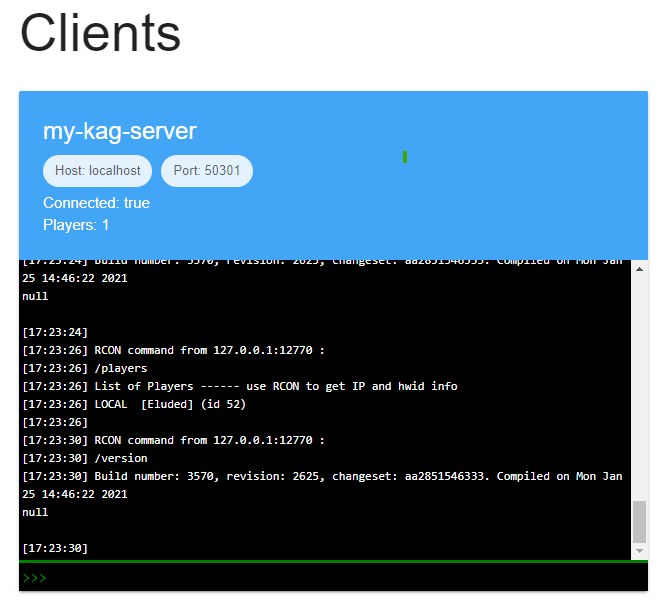

one_click_kag_server
=====

`one_click_kag_server` is a program which tries to fully automate the creation of a [King Arthur's Gold](https://kag2d.com/en/) server.

It will:
* Create a virtual machine for you on DigitalOcean
* Configure the machine to run KAG
* Create SSH keys
* Upload and setup mods
* Setup security configuration such as list of admins
* Deploy the KAG server with automatic restarts enabled

It can also help with common maintenance tasks such as:
* Restarting the server with different configuration, such as new mods
* Viewing the server logs
* Opening a TCPR console
* Opening an SSH connection to the server

Everything can be configured from a single config file (see `config.yaml`).

This is a viable alternative to running a server on your local machine, without the hassle of setting up port forwarding etc. It's also an alternative to dedicated KAG hosting sites such as https://gshost.us/, with the advantage of costing less and not charging based on configuration such as max players. For example, a minimum spec server on DigitalOcean costs $0.007/hour or $5/month ([see here](https://slugs.do-api.dev/)). Since this project makes it easy to create and delete servers, you may want to run a more expensive, powerful machine for just a couple of hours and then delete it when you're done.

An admin interface for RCON access can be deployed with the `rcon` command, using [kagtcprlib](https://github.com/benjamingorman/kagtcprlib).

Contact Eluded#1367 on Discord if you have any feedback or need help getting set up.

## Instructions

### Setup

Before using `one_click_kag_server`, there are a few things to setup.

1. Install Python (3.7+) on your system. https://www.python.org/downloads/
1. Clone this repository. If you don't have Git installed you can also click Code -> Download ZIP from GitHub.
1. Install `one_click_kag_server` requirements. Open a terminal in this directory and run `pip install -r requirements.txt`
1. Make an account on DigitalOcean. See https://cloud.digitalocean.com/registrations/new
1. Setup a payment method on DigitalOcean
1. Create an API token on DigitalOcean.
    * Go to API
    * Click Generate New Token
    * Choose a name for the token and give it both read and write scope

Estimated time: ~10 minutes.

### Creating a server

This section describes how to create a server, assuming you have followed the setup instructions above.

1. Edit `config.yaml` with a text editor to configure your server.
    * `secrets`
        * `digitalocean_key` the DigitalOcean API token you created earlier. Do not share this with anyone, since it gives full access to your account.
    * `droplet` configures the virtual machine
        * `name` is the name of the virtual machine (make sure it only contains characters URL-safe characters, so no spaces)
        * `region` is the short name (a.k.a. *slug*) for the DigitalOcean region to deploy the server in. If you want a US based server you can leave it as `nyc1`. For an EU server you could try `ams3`. For a full list of possible regions see https://slugs.do-api.dev/ (open the Regions tab).
        * `image` is the type of virtual machine to deploy. Don't change this unless you know what you're doing.
        * `size_slug` is the size of the machine to deploy. Think about this carefully because there are many options, though more powerful machines are more expensive. For a full list of possible sizes see https://slugs.do-api.dev/ (open the Droplet Sizes tab).
        * `backups` is whether or not to configure backups. You shouldn't need them, since it's so easy just to delete and re-create your server later.
    * `kag` configures the KAG server
        * `autoconfig` can contain any regular option from KAG's `autoconfig.cfg`
            * `sv_name` the name of the server
            * `sv_info` the server description
            * `sv_maxplayers` the max number of players
            * `sv_gamemode` the gamemode (e.g. TDM or CTF)
            * `sv_register` whether to list the server publicly
            * `sv_password` the password to connect to the server (can be empty for a public server)
            * `sv_rconpassword` the RCON password for the server
            * `security_seclevs` path to seclevs file. Don't change this.
        * `mods` is a list of mods to use. If you add a mod here, also copy it into the `Mods` directory in this project.
        * `security`
            * `superadmins` list of usernames of superadmins
            * `admins` list of usernames of admins
1. Open a terminal in this directory and run `python -m one_click_kag_server.main up` to deploy the server.
    * You should see a bunch of log messages whilst the server is being configured.
    * After around 2 minutes the server should be ready, and you should see a message saying `DONE. Server running at {ip_address}`. Your server should be ready to play on.

If you wish to have multiple config files with different names then you can pass the `--config-file` option to switch between them.

If you have any issues with the above then please report them to me on Discord (Eluded#1367).

## Commands

`one_click_kag_server` offers a few different commands for maintenance of the server.

#### up

Run `python -m one_click_kag_server.main up` to deploy the virtual machine and start KAG.

#### down

Run `python -m one_click_kag_server.main down` to destroy the virtual machine.

#### restart-kag

Run `python -m one_click_kag_server.main restart-kag` to restart the KAG server. This will also upload any new mods or configuration, for example if you've changed `autoconfig` in `config.yaml`.

#### kag-logs

Run `python -m one_click_kag_server.main kag-logs` to view the KAG logs in real-time.

#### ssh

Run `python -m one_click_kag_server.main ssh` to open an SSH connection to the server. This requires SSH to be installed on your system.

## Important notes

### State

Information about the server is stored in a state file (by default `state.pkl` in this directory). Every time `one_click_kag_server` runs, this file is updated. If you delete or move the file then information about the server will be lost, and `one_click_kag_server` will create a brand new server if you run it again. If you lose your state file, you may need to manually login to DigitalOcean and delete your droplet(s). Also, if you want to deploy multiple servers then you may need multiple state files (use the `--state-file` argument to change this.)

### SSH Keys

`one_click_kag_server` creates a new SSH key pair for virtual machines access, and uploads this to your DigitalOcean account. These keys can be found under `ssh_keys/`. If you want to access the server with some other SSH client then you need to use this key pair. For example `$ ssh -i ssh_keys/one_click_kag_server_aa0ff419 root@$SERVER_HOST`.